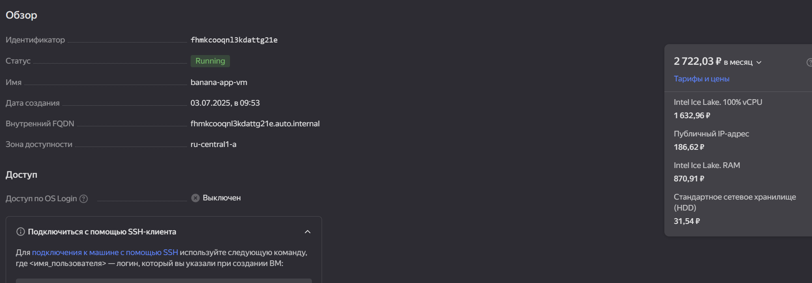

# Домашнее задание 9

## PostgreSQL и VKcloud, ЯО, Sbercloud

### Сравнение управляемых экземпляров postgres в Yandex Cloud и Sber Cloud

Для задания выбраны Yandex Cloud, т.к. с ним уже работаем и Cloud.ru,как имеющий наиболшее распространение, согласно отчетам по облачным платформам.

#### Yandex Cloud

Создадим управляемый экземпляр с параметрами 2 ядра, 4 ГБ памяти, 10ГБ net-HDD диск в консоли.


Создадим ВМ 
banana-app-vm с любыми характеристиками, публичным доступом в той же сети, что и управляемый экземпляр для проведения тестирования.

В качестве методики тестирования выберем утилиту pgbench, нагрузку формата tpc-b в течение 60сек и количество транзакций, выполненных за это время. 
Создадим пользователя bapp, БД banana-db и выполним инициализацию:

```console
pgbench -h rc1a-n17743h9***.mdb.yandexcloud.net     -p 6432 -U bapp -s 10  banana-db
```

Выполним тестирование:

```console
badmin@fhmkcooqnl3***:~$ pgbench -h rc1a-n17743h9f231***.mdb.yandexcloud.net     -p 6432 -U bapp -T 60  banana-db
pgbench (14.18 (Ubuntu 14.18-0ubuntu0.22.04.1))
starting vacuum...end.
transaction type: <builtin: TPC-B (sort of)>
scaling factor: 10
query mode: simple
number of clients: 1
number of threads: 1
duration: 60 s
number of transactions actually processed: 8958
latency average = 6.703 ms
initial connection time = 7.327 ms
tps = 149.179217 (without initial connection time)

```

Результат: 8958 транзакций.

#### Cloud.ru
Создадим управляемый экземпляр с параметрами 2 ядра, 4 ГБ памяти, 10ГБ SDD диск в консоли.


Создадим ВМ 
banana-app-vm с любыми характеристиками, публичным доступом в той же сети, что и управляемый экземпляр для проведения тестирования.


В качестве методики тестирования выберем утилиту pgbench, нагрузку формата tpc-b в течение 60сек и количество транзакций, выполненных за это время. 
Создадим пользователя badmin, БД bananadb и выполним тестирование:

```console
root@banana-app-vm:~# pgbench -h banana-cluster-1 -Ubadmin -T 60 bananadb
pgbench (16.9 (Ubuntu 16.9-0ubuntu0.24.04.1), server 14.13 (Debian 14.13-1.pgdg110+1))
starting vacuum...end.
transaction type: <builtin: TPC-B (sort of)>
scaling factor: 10
query mode: simple
number of clients: 1
number of threads: 1
maximum number of tries: 1
duration: 60 s
number of transactions actually processed: 2113
number of failed transactions: 0 (0.000%)
latency average = 28.382 ms
initial connection time = 50.261 ms
tps = 35.233904 (without initial connection time)
```

Результат: 2113 транзакций.

Даже без сравнения производительности, где YC выигал, я бы не рискнул предложить Cloud.ru/Evolution как допустимый вариант. После недели работы с ним сложилось впечатление плохо продуманного, имеющего непонятную логику и плохо описанного сервиса. Он был запущен недвано, возможно вырастет.

## Задание * - автоматизация

### Автоматизируем YC

Автоматизация развертывания с terraform
Выполним сценарий развертывания сервера СУБД с БД и сервера приложений. С удаленного клиента выполним тестирование производительности с использованием плейбука ansible.
Настроим terraform и опишем провайдера (пропущено для сокращения места). Создадим файл описания ресурсов.Для сокращения размера в отчете указываем параметры, принимаемые условно статичными, сразу в нем.

<details>
  <summary>main.tf</summary>

  ```yaml
  /*
export YC_TOKEN=$(yc iam create-token)
export YC_CLOUD_ID=$(yc config get cloud-id)
export YC_FOLDER_ID=$(yc config get folder-id) 
*/
//Создаем сервер БД

resource "yandex_mdb_postgresql_cluster" "banana_db" {
  name        = "banana_db"
  environment = "PRODUCTION"
  network_id  = yandex_vpc_network.pg_banana_net.id
  security_group_ids = [yandex_vpc_security_group.banana_sg.id]
  config {
    version = 14
    resources {
        resource_preset_id = "c3-c2-m4"
        disk_type_id       = "network-hdd"
        disk_size          = 10
      }

    postgresql_config = {
        max_connections                = 300      
      }
    }
    maintenance_window {
    type = "WEEKLY"
    day  = "SAT"
    hour = 12
  }

  host {
    zone      = "ru-central1-a"
    subnet_id = yandex_vpc_subnet.pg_banana_net.id    
  }
}
//Создаем БД и пользователя
resource "yandex_mdb_postgresql_database" "banana-db" {
  cluster_id = yandex_mdb_postgresql_cluster.banana_db.id
  name       = "banana-db"
  owner      = "bapp"  
  depends_on = [yandex_mdb_postgresql_user.bapp]
}

resource "yandex_mdb_postgresql_user" "bapp" {
  cluster_id = yandex_mdb_postgresql_cluster.banana_db.id
  name       = "bapp"
  password   = "***"
  depends_on = [yandex_mdb_postgresql_cluster.banana_db]
}

//Создаем сервер для проведения тестов
resource "yandex_compute_disk" "boot_disk" {
  name     = "banana-app-boot-disk"
  zone     = "ru-central1-a"
  image_id = "fd8ba9d5mfvlncknt2kd" #Ubuntu 22.04
  
  type = "network-hdd"
  size = 10
}
resource "yandex_vpc_address" "app-addr" {
  name = "banana-app-vm-adress"
  external_ipv4_address {
    zone_id = "ru-central1-a"
  }
}
resource "yandex_compute_instance" "this" {
  name                      = "banana-app-vm"
  allow_stopping_for_update = true
  platform_id               = "standard-v3"
  zone                      = "ru-central1-a"

  resources {
    cores  = 2
    memory = 4
  }

  boot_disk {
    disk_id = yandex_compute_disk.boot_disk.id
  }

  network_interface {
    subnet_id = yandex_vpc_subnet.pg_banana_net.id
    nat            = true
    nat_ip_address = yandex_vpc_address.app-addr.external_ipv4_address[0].address
  }
  metadata = {    
    "user-data": "#cloud-config\npackage_update: true\npackages:\n  - postgresql-contrib\nusers:\n  - name: badmin\n    groups: sudo\n    shell: /bin/bash\n    sudo: 'ALL=(ALL) NOPASSWD:ALL'\n    ssh_authorized_keys:\n      - ssh-rsa AAAAB3NzaC1***ZgIpOE="
  }
}

// Прочие ресурсы
resource "yandex_vpc_network" "pg_banana_net" {
}

resource "yandex_vpc_subnet" "pg_banana_net" {
  zone           = "ru-central1-a"
  network_id     = yandex_vpc_network.pg_banana_net.id
  v4_cidr_blocks = ["10.5.0.0/24"]
}

resource "yandex_vpc_security_group" "banana_sg" {
  name        = "banana_sg"
  network_id  = yandex_vpc_network.pg_banana_net.id

  ingress {
    protocol       = "TCP"
    port           = 22
    v4_cidr_blocks = ["0.0.0.0/0"]
  }

  ingress {
    protocol       = "TCP"
    port           = 6432
    v4_cidr_blocks = ["10.0.0.0/8"]
  }

  egress {
    protocol       = "ANY"
    port           = 0
    v4_cidr_blocks = ["0.0.0.0/0"]
  }
}

  ```

</details>

Созданные элементы


Создадим простой плейбук. Для сокращения размера в отчете указываем параметры, принимаемые условно статичными, непосредственно в плейбуке

<details>
  <summary>test.yml</summary>

  ```yaml
  ---
- name: Performance test
  hosts: all
  vars_files:
    - vars
  tasks:
    - name: Create pgpass
      lineinfile: path='~/.pgpass' line='*:*:*:bapp:banana123' mode='0400' create=yes
    - name: Init pgbench DB
      shell: pgbench -U bapp -h "{{ pghost }}" -p "{{ pgport }}" -i -s 10 "{{ dbname }}"
    - name: Perform test
      shell: pgbench -U bapp -h "{{ pghost }}" -p "{{ pgport }}" -T 60 "{{ dbname }}" 2>&1 |grep "number of transactions"
      register: bench_out
    - debug: msg="{{ bench_out.stdout }}"
```

</details>

и файл переменных

<details>
  <summary>vars</summary>
  
  ```yaml
  ---
ansible_ssh_user: badmin
pgport: 6432
```

</details>
Выполним тестирование

```console
root@u1:~/bench# ansible-playbook --inventory=89.169.**, --extra-vars "pghost=rc1a-n17743h9f2****.mdb.yandexcloud.net pgport=6432" ./test.yml

PLAY [Performance test] ******************************************************************************************

TASK [Gathering Facts] *******************************************************************************************
ok: [89.169.**]

TASK [Create pgpass] *********************************************************************************************
ok: [89.169.**]

TASK [Init pgbench DB] *******************************************************************************************
changed: [89.169.**]

TASK [Perform test] **********************************************************************************************
changed: [89.169.**]

TASK [debug] *****************************************************************************************************
ok: [89.169.**] => {
    "msg": "number of transactions actually processed: 9277"
}

PLAY RECAP *******************************************************************************************************
89.169.**             : ok=5    changed=2    unreachable=0    failed=0    skipped=0    rescued=0    ignored=0
```

Результат: 9277 транзакций.

Автоматизацию Cloud.ru/Evolution не смог выполнить, т.к. заявленные механизмы мало описаны и не работают как ожидается - возможно позже.